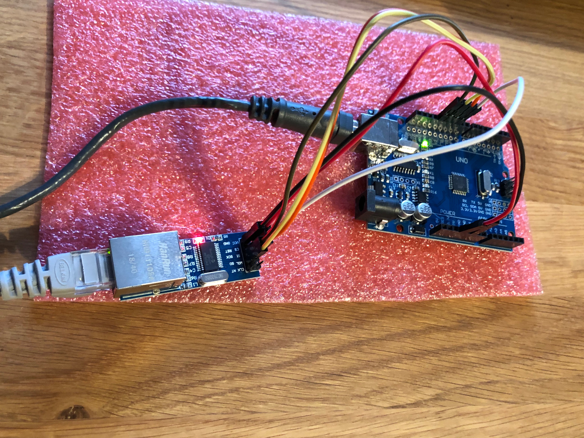

# DHCP hello world for Arduino UNO with ENC28J60

## Install

As a dependency, you have to have PlatformIO installed. Please see [PlatformIO installation] documentation.

```
$ pio lib install "UIPEthernet"
$ platformio run --target upload
$ platformio device monitor
```

## Parts List

* Arduino UNO (or clone, I'm using [XDRuino UNO])
* ENC28J60 module. There are plenty, I'm using [ENC28J60 module mini]
* Bunch of wires

## Wiring

```
UNO PIN 3.3V ----- ENC28J60 module PIN VDD
UNO PIN GND ------ ENC28J60 module PIN GND
UNO PIN 10 ------- ENC28J60 module PIN CS
UNO PIN 11 ------- ENC28J60 module PIN SI
UNO PIN 12 ------- ENC28J60 module PIN SO
UNO PIN 13 ------- ENC28J60 module PIN CLK


```



[PlatformIO installation]: http://docs.platformio.org/en/latest/installation.html
[XDRuino UNO]: http://www.dx.com/p/uno-r3-development-board-microcontroller-mega328p-atmega16u2-compat-for-arduino-blue-black-215600#.Wdil7hdBoUE
[ENC28J60 module mini]: https://www.aliexpress.com/item/ENC28J60-SPI-interface-network-module-Ethernet-module-mini-version/32341839317.html 

