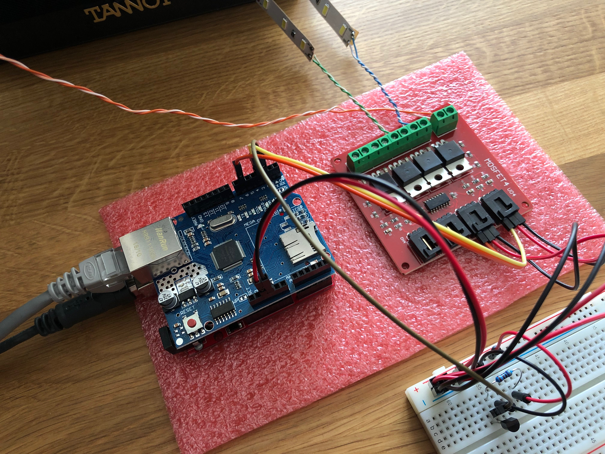

# Arduino UNO PWM driver accessible over MQTT

## Install

As a dependency, you have to have PlatformIO installed. Please see [PlatformIO installation] documentation.

```
$ pio lib install "Ethernet"
$ pio lib install "PubSubClient"
$ pio lib install "OneWire"
$ platformio run --target upload
$ platformio device monitor
```

## Usage

IP address is obtained using DHCP. The gateway IP is used as
MQTT broker (with default port 1883).

The name of the device is the MAC address without ":". The name
is used in MQTT topics. For example:

```
fe77d1a71603/pwm0/set
```

The device published following topics when values are set:

```
[NAME]/pwm0
[NAME]/pwm1
[NAME]/pwm2
```

The device is configurable over MQTT, the topics it subscribes to are:
```
[NAME]/pwm0/set (0 to 1023)
[NAME]/pwm1/set (0 to 1023)
[NAME]/pwm2/set (0 to 1023)
```

## Parts List

* Arduino UNO (or clone, I'm using [XDRuino UNO])
* [Ethernet Shield] Ethernet Shield
* DS2401 ID chip [DS2401] - Using value from this a a base for MAC address
* Bunch of wires

## Wiring

```
UNO PIN 2 -------- DS2401 PIN 2 (DQ)
UNO PIN 5V ------- 4k7 Ohm pull-up resistor --------  DS2401 PIN 2 (DQ)
UNO PIN GND ------ DS2401 PIN 1 (GND)

UNO PIN 3 -------- PWM 0 (external device with input 0-5V)
UNO PIN 6 -------- PWM 1 (external device with input 0-5V)
UNO PIN 9 -------- PWM 2 (external device with input 0-5V)
```


```

[PlatformIO installation]: http://docs.platformio.org/en/latest/installation.html
[XDRuino UNO]: http://www.dx.com/p/uno-r3-development-board-microcontroller-mega328p-atmega16u2-compat-for-arduino-blue-black-215600#.Wdil7hdBoUE
[Ethernet Shield]: https://www.arduino.cc/en/Guide/ArduinoEthernetShield
[DS2401]: https://datasheets.maximintegrated.com/en/ds/DS2431.pdf
