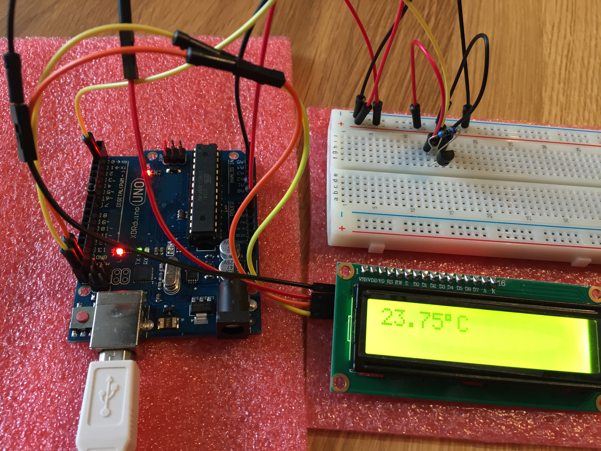

# Simple thermometer for Arduino UNO

## Install

As a dependency, you have to have PlatformIO installed. Please see [PlatformIO installation] documentation.

```
$ pio lib install "OneWire"
$ pio lib install "DallasTemperature"
$ pio lib install "LiquidCrystal_I2C"
$ platformio run --target upload
$ platformio device monitor
```

## Parts List

* Arduino UNO (or clone, I'm using [XDRuino UNO])
* [DS18B20] Temperature sensor
* [1602 LCD] with PCF8574 IO Expander
* 4k7 Ohm pull-up resistor
* Solderless breadboard
* Bunch of wires

## Wiring

```
UNO PIN 5V ----- DS18B20 PIN 3 (VDD)
UNO PIN 2 ------ DS18B20 PIN 2 (DQ)
UNO PIN GND ---- DS18B20 PIN 1 (GND)

DS18B20 PIN 2 (DQ) ---- 4k7 Ohm pull-up resistor ---- DS18B20 PIN 3 (VDD)

UNO PIN 5V ----- LCD PIN VCC
UNO PIN GND ---- LCD PIN GND
UNO PIN SDA ---- LCD PIN SDA
UNO PIN SCL ---- LCD PIN SCL

```



[PlatformIO installation]: http://docs.platformio.org/en/latest/installation.html
[XDRuino UNO]: http://www.dx.com/p/uno-r3-development-board-microcontroller-mega328p-atmega16u2-compat-for-arduino-blue-black-215600#.Wdil7hdBoUE
[1602 LCD]: http://www.dx.com/p/i2c-iic-lcd-1602-yellow-green-display-module-w-4p-wire-for-arduino-441734#.WdimBxdBoUE
[DS18B20]: https://datasheets.maximintegrated.com/en/ds/DS18B20.pdf

