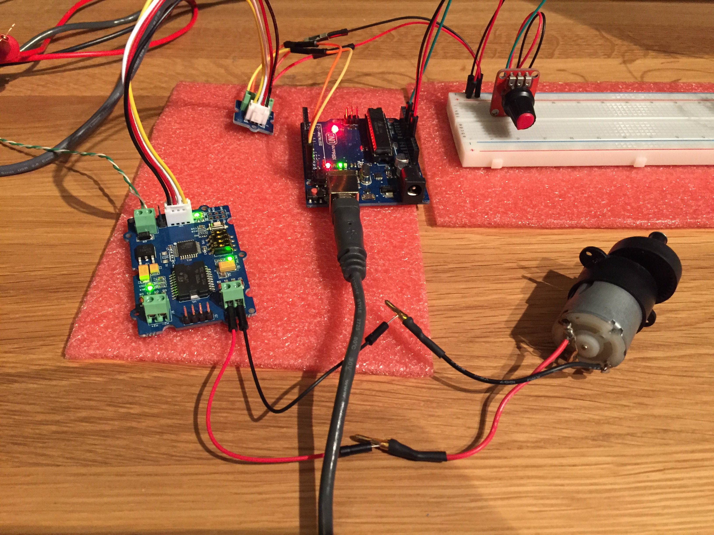

# Simple motor drive with Grove I2C Motor Driver for Arduino UNO

## Install

As a dependency, you have to have PlatformIO installed. Please see [PlatformIO installation] documentation.

```
$ pio lib install "OneWire"
$ cd lib
$ git clone https://github.com/Seeed-Studio/Grove_I2C_Motor_Driver_v1_3.git
$ cd ..
$ platformio run --target upload
$ platformio device monitor
```

## Parts List

* Arduino UNO (or clone, I'm using [XDRuino UNO])
* [Potentiometer module for Arduino]
* [Grove I2C Motor Driver] V1.3
* A DC motor
* Solderless breadboard
* Bunch of wires

## Wiring

```
UNO PIN A0 ----- POTENTIOMETER PIN S
UNO PIN 5V ----- POTENTIOMETER PIN +
UNO PIN GND ---- POTENTIOMETER PIN -

UNO PIN 5V ----- GROVE PIN VCC
UNO PIN GND ---- GROVE PIN GND
UNO PIN SDA ---- GROVE PIN SDA
UNO PIN SCL ---- GROVE PIN SCL

GROVE PIN M1+ ---- DV motor +
GROVE PIN M1- ---- DV motor -
```

Depends on you if you want to power the motor from UNO or you want to connect the Grove motor driver to an external power supply.




[PlatformIO installation]: http://docs.platformio.org/en/latest/installation.html
[XDRuino UNO]: http://www.dx.com/p/uno-r3-development-board-microcontroller-mega328p-atmega16u2-compat-for-arduino-blue-black-215600#.Wdil7hdBoUE
[Potentiometer module for Arduino]: http://www.dx.com/p/potentiometer-module-for-arduino-red-black-149584#.WhB8lRemkUE
[Grove I2C Motor Driver]: http://wiki.seeed.cc/Grove-I2C_Motor_Driver_V1.3/

